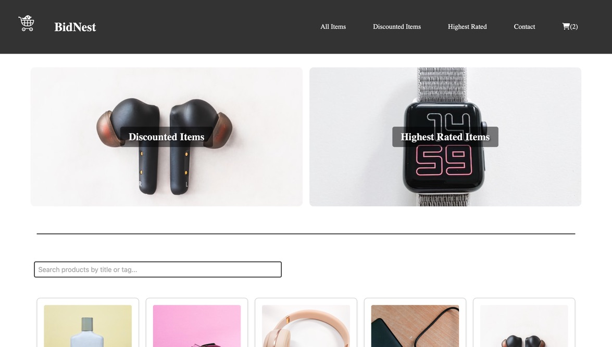
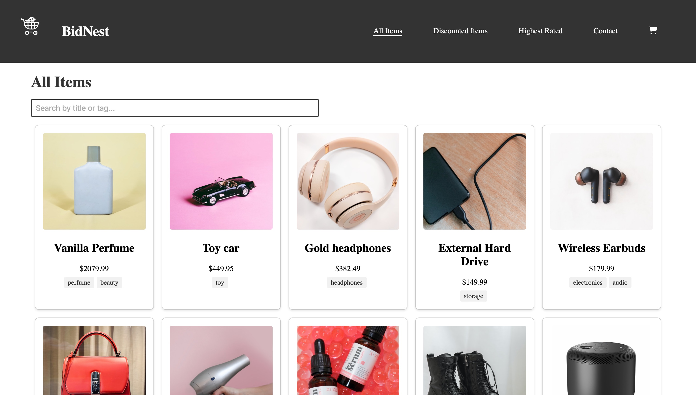
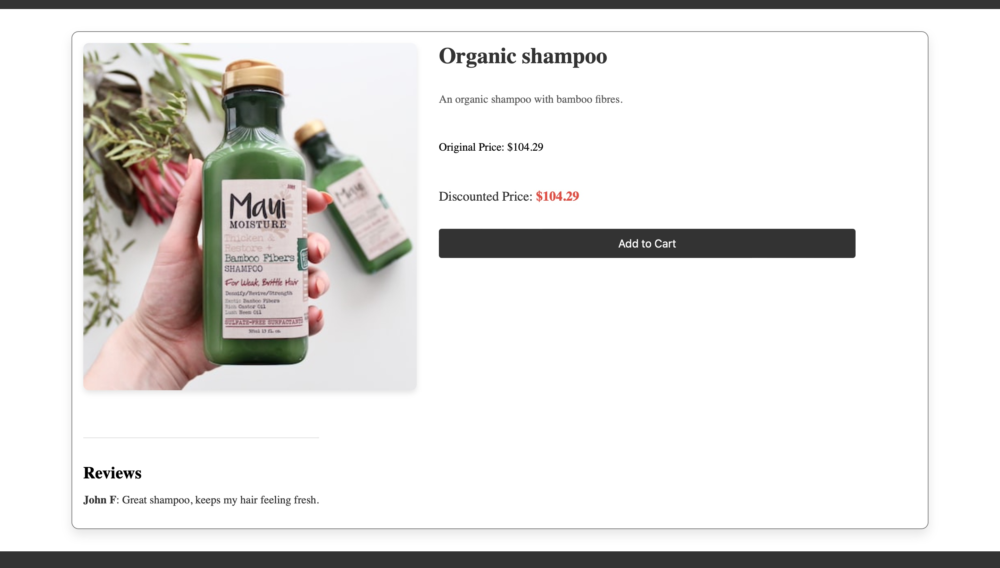
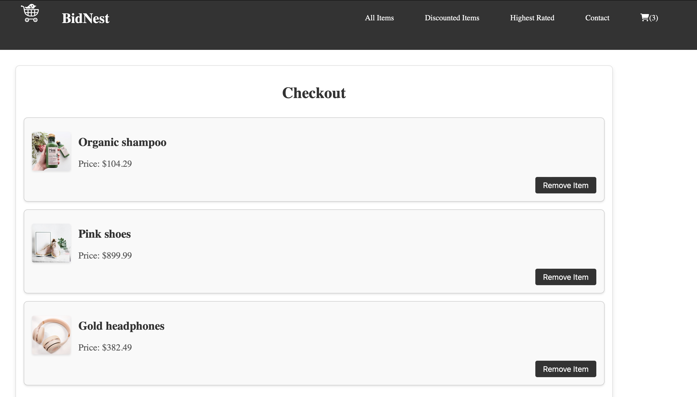
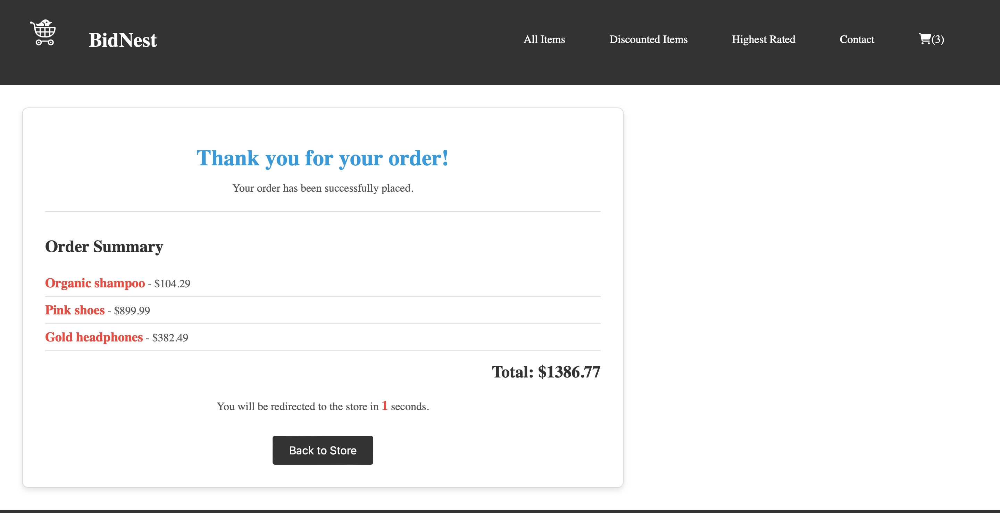

---

---

# Semester Project 2, year 2- 
---

This project was our second larger project of the year, and so far, the largest workload we had been given. 

Our Brief:

    Goal:
    To take the skills learned over the past three semesters and create an auction website.

    Brief
    An auction site is looking to launch a website where users can add items to be bid on and bid on items other users have put up for auction.

    When a new user joins the website, they are given 1000 credits to use on the site. They can get credits by selling items and use credit by buying items. Non-registered users      can search through the listings, but only registered users can make bids on listings.

User stories

The client has specified the following requirements in the form of User Stories:

    A user with a stud.noroff.no email may register -------- (Done)
    A registered user may login -------- (Done)
    A registered user may logout -------- (Done)
    A registered user may update their avatar -------- (Done)
    A registered user may view their total credit -------- (Done)
    A registered user may create a Listing with a title, deadline date, media gallery and description -------- (Done)
    A registered user may add a Bid to another user’s Listing -------- (Done)
    A registered user may view Bids made on a Listing -------- (Done)
    An unregistered user may search through Listings -------- (Done)

Technical restrictions

    The company CTO has set the following technical restrictions:

    Must use an approved CSS Framework -------- (Bootstrap)
    Must be hosted on an approved Static Host -------- (Netlify)
    Must use an approved Design Application 
    Must use an approved Planning Application
    
Required links

The Product Owner has requested links to the following:

    A Gantt chart for project timing -------- (Done)
    A design prototype -------- (Done)
    A style guide -------- (Done)
    A kanban project board
    A repository link
    A hosted application demo link

## Additional resource information:

Approved resources
This list covers libraries and services that have been vetted by the company and approved for use.

    CSS processors

    SASS/SCSS
    PostCSS
    CSS frameworks

    Bootstrap (version >5.0.1)
    Tailwind (version >3.0.0)
    MUI (version >5.11.8)
    
Hosting services

    GitHub Pages
    Netlify
    Design applications

    Adobe XD
    Figma
    Sketch
    Planning applications

    Trello
    GitHub Projects
    Notion
    Delivery
    Include the required links in the Moodle delivery window using this template format.

All final changes must be merged into the default branch main or master. Other branches will not be checked.

Ensure that the readme.md file describes your project thoroughly, including how to setup and run the project locally and any special instructions for testers.

## Any left on the "To Do" list/ future plans for this project:

    Yet to do/ wish to add:
    
    - (Priority) Decipher why the credits are stripped after logging out and in again
    

    - Modal view of each listing
    - See details of another user's profile
    - See the listings that a user has added (attahed to their profile)
    - Refund credits on a non winning bid on an item
    - Show items that a user has won on their profile
    - Show items that a user has bid on, on their profile
    - Add "Show More" and "Show Less" buttons on the All Users page
    - Add a button in the profile page that takes you immediately down to the "Create Listing form"
    - Loading Icons upon navigation

    
    

## Site purpose:

** Important **

(Only users with an @noroff.no/ @stud.noroff.no account can register or sign in)

Our goal was to create, so far as possible, an auction site- Should open on the landing page that allows an unregistered user to browse the listings, and from there login/ register only with an @noroff.no/ @stud.noroff.no email. The users are given 1000 credits upon registering that allows the m to bid on an item.
From here the user should be directed to the full landing page- here the listings are still displayed, the user can search through the listings, and filter them to see only the active ones.
Upon clicking to view a listing, the user can see the details, bidding history, time left until the end of the auction and make a bid that will be visible on the bid history. 
The appropriate credits will be deducted when a bid is made.

The user can navigate to their profile and see the information that they entered upon registration. Their Username, Email, Avatar, Banner and Credits- 
The listings of the user will be displayed above the "create listings" form. 
The user should be able to create a listing that has a date and time of the end of the auction- a user cannot bid on their own item. You can edit said listing after its creation.
At the end of the auction the losing bid credits should be refunded.
The user can edit their avatar after creation of an account.

The user should be able to log out of their account then sign back in with the email they registred with.

---

There is a page that shows all users- but this needs more work.

### Description

-- Landing page

Similar to the home page, but the user can only register and log in
(Must remember to later remove the bid buttons for the listings displayed here.)

-- Login/ register

Should be able to register, first and foremost- this will create a profile for the user.
Login should be able to do similar, but with a previously registered email and name etc.

-- Home Page

Similar to the landing page, but here the user can bid on items, see their profile, see all other users, etc

-- Profile--

The user can see the details they presented upon registration and edit them- it also displays the credits still remaining for the user.
Here is displayed all of the listings that the user has created-

(Later wil be displayed all of the listings that the user has bid on and another section for all of the listings that they have won)

There is the create listings page that allows the user to create a listing.

-- All users

Design is similar to the home page- but shows all of the fellow users on the site.
Will eventually add functionality to these so that the user can click and see the profile page of each user, and the listings each user has created.

---

** Note **

## Did not use pure Bootstrap, as I find it exceptionally impractical and not very responsive. It is only used on the login and register forms.

   

#### Getting Started

Installing

Clone the repo:

    git clone git@github.com: https://github.com/AutopsyTurvy/Semester-Project-2-Kitty-Alice-Case.git

Install the dependencies: N/A

    npm install

Running

To run the app, run the following commands:

    npm run start

(You may also choose to add to/ clone this code in another way than through the command line or terminal, and you may do this by opening it in your chosen code editor, via GitHub desktop, and subsequently, VScode. )

---

Contributing

Contributions are welcome, but I would request that the invidicual that does so, clones the code and adds notes so that I can review any changes before they are comitted to the project permanently. Thank you! 

---

Contact:

Email me: 
autopsyturvycoding@gmail.com

 

Find me on Discord:
(Kitty Alice Case
kittyalicerayworth)

---

# Getting Started with Create React App

This project was bootstrapped with [Create React App](https://github.com/facebook/create-react-app).

## Available Scripts

In the project directory, you can run:

### `npm start`

Runs the app in the development mode.\
Open [http://localhost:3000](http://localhost:3000) to view it in your browser.

The page will reload when you make changes.\
You may also see any lint errors in the console.

### `npm test`

Launches the test runner in the interactive watch mode.\
See the section about [running tests](https://facebook.github.io/create-react-app/docs/running-tests) for more information.

### `npm run build`

Builds the app for production to the `build` folder.\
It correctly bundles React in production mode and optimizes the build for the best performance.

The build is minified and the filenames include the hashes.\
Your app is ready to be deployed!

See the section about [deployment](https://facebook.github.io/create-react-app/docs/deployment) for more information.

### `npm run eject`

**Note: this is a one-way operation. Once you `eject`, you can't go back!**

If you aren't satisfied with the build tool and configuration choices, you can `eject` at any time. This command will remove the single build dependency from your project.

Instead, it will copy all the configuration files and the transitive dependencies (webpack, Babel, ESLint, etc) right into your project so you have full control over them. All of the commands except `eject` will still work, but they will point to the copied scripts so you can tweak them. At this point you're on your own.

You don't have to ever use `eject`. The curated feature set is suitable for small and middle deployments, and you shouldn't feel obligated to use this feature. However we understand that this tool wouldn't be useful if you couldn't customize it when you are ready for it.

## Learn More

You can learn more in the [Create React App documentation](https://facebook.github.io/create-react-app/docs/getting-started).

To learn React, check out the [React documentation](https://reactjs.org/).

### Code Splitting

This section has moved here: [https://facebook.github.io/create-react-app/docs/code-splitting](https://facebook.github.io/create-react-app/docs/code-splitting)

### Analyzing the Bundle Size

This section has moved here: [https://facebook.github.io/create-react-app/docs/analyzing-the-bundle-size](https://facebook.github.io/create-react-app/docs/analyzing-the-bundle-size)

### Making a Progressive Web App

This section has moved here: [https://facebook.github.io/create-react-app/docs/making-a-progressive-web-app](https://facebook.github.io/create-react-app/docs/making-a-progressive-web-app)

### Advanced Configuration

This section has moved here: [https://facebook.github.io/create-react-app/docs/advanced-configuration](https://facebook.github.io/create-react-app/docs/advanced-configuration)

### Deployment

This section has moved here: [https://facebook.github.io/create-react-app/docs/deployment](https://facebook.github.io/create-react-app/docs/deployment)

### `npm run build` fails to minify

This section has moved here: [https://facebook.github.io/create-react-app/docs/troubleshooting#npm-run-build-fails-to-minify](https://facebook.github.io/create-react-app/docs/troubleshooting#npm-run-build-fails-to-minify)
